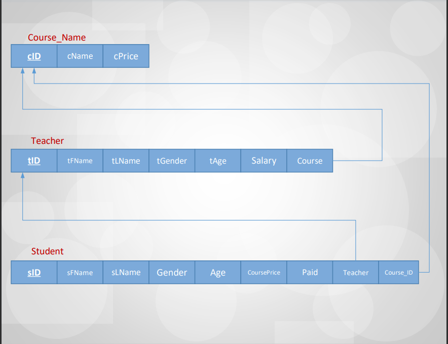

### Languages Center

A winforms application as shown in the [demonstration](https://youtu.be/2-xPXOxrE9E).

## Requirements Collection

A center which serve anyone to learn languages by teachers from that language country. As a beginner center we only have five languages and each one has more than one teacher.

So far, we have 12 teachers with different experience depends on their age. We accept students under variance ages. Each language course has its ID & price.

Each teacher has its ID, age, gender and age. We take from each student his name, age, gender, the course he wants, the teacher he chooses & we give him an ID for sure.

## Conceptual design (Entity-Relationship Model)

## Conceptual Design (Conceptual Schema)

